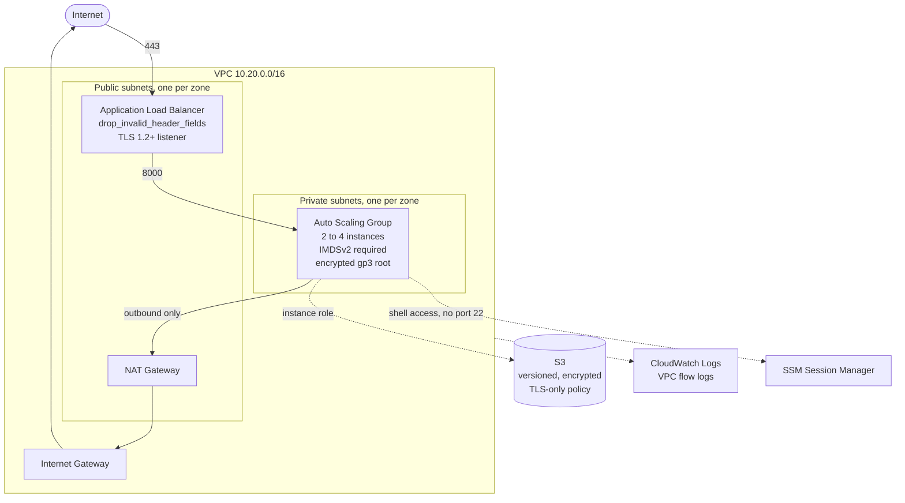
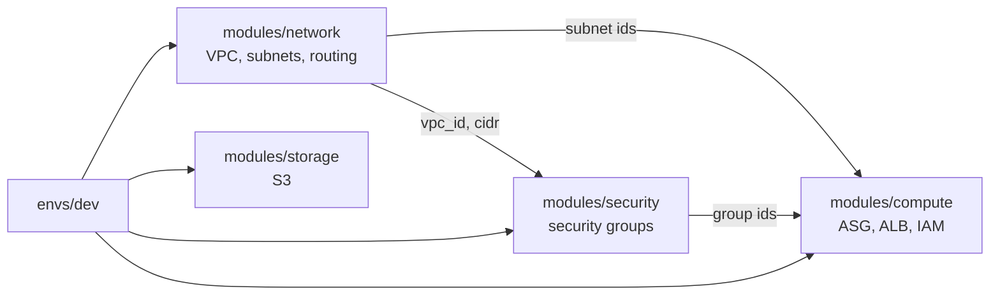
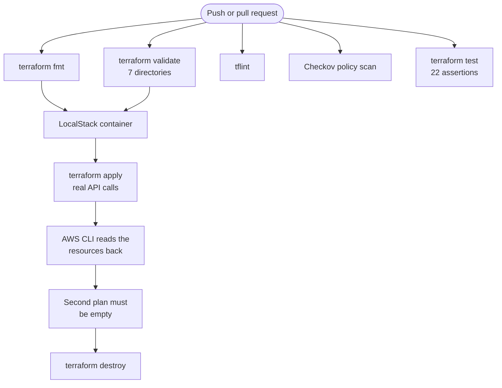

# Architecture

## The stack

Traffic reaches the load balancer in the public subnets and nothing else. The
instances live in private subnets with no route in from the internet; their
only inbound rule references the load balancer's security group rather than an
address range. Outbound traffic leaves through the NAT gateway.

There is no bastion host, no key pair and no port 22 rule anywhere. Shell
access is through SSM Session Manager, which is audited and requires no
inbound port.

## Module dependencies

Modules depend on each other only through explicit outputs. None of them reads
another's state or looks anything up by tag, so any one can be replaced without
touching the others.

## What CI verifies, and how

The distinction that matters is between the checks that read the configuration
and the one that runs it.

`fmt`, `validate`, `tflint`, `Checkov` and `terraform test` all reason about
what the code says. They are fast, they need no credentials, and they catch
most mistakes. What they cannot catch is a resource created in the wrong order,
an argument the provider accepts but the service rejects, or a plan that never
converges.

The LocalStack job applies the configuration for real, then queries the result
with the AWS CLI rather than trusting the apply's own output, then plans again
and fails if the second plan is not empty.

## Coverage and its limits

| Component | validate | tflint | Checkov | unit tests | real apply |
|---|:--:|:--:|:--:|:--:|:--:|
| VPC, subnets, routing | yes | yes | yes | yes | yes |
| Security groups | yes | yes | yes | yes | yes |
| S3 buckets and controls | yes | yes | yes | yes | yes |
| S3 lifecycle rules | yes | yes | yes | yes | no |
| IAM | yes | yes | yes | — | partial |
| NAT gateway | yes | yes | yes | yes | no |
| Load balancer | yes | yes | yes | — | no |
| Auto scaling group | yes | yes | yes | — | no |

The four rows without a real apply are the parts LocalStack's free tier does
not emulate. Three of them it simply does not implement. S3 lifecycle rules are
the subtler case: it accepts the configuration and then never returns it, so
the provider's read-back poll times out after three minutes, which is why the
LocalStack environment turns that one resource off.

They are listed here rather than quietly omitted, because a coverage claim that
overstates itself is worse than no claim.

## Cost

`envs/dev` left running costs roughly 40 to 60 EUR a month. Almost all of that
is the NAT gateway and the load balancer, which bill hourly whether or not
anything is using them. `terraform destroy` removes the lot.

The dev environment sets `single_nat_gateway = true`, trading zone
independence for about 35 EUR a month. Production should not.
